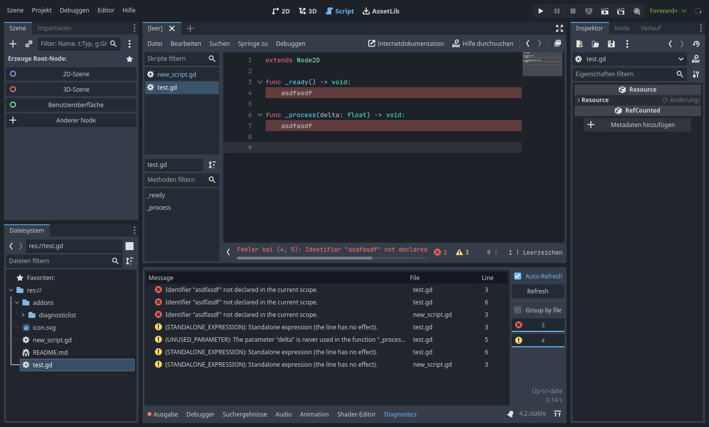

# Godot Diagnostic List

This editor plugin provides project-wide diagnostics for GDScript files. 
It tracks every GDScript file in the project and gathers all errors and warnings in a global list. 
Especially useful when working on large-scale changes, e.g. refactoring or porting a project from Godot 3.x to 4.x.

Compatible with Godot 4.2+.

## Installation

1. Download or clone this repository and copy the `addons/` directory to your project.
2. Enable the plugin in the project settings
3. (Possibly) Restart Godot

## Usage

The diagnostic panel appears in the bottom dock.

Double-clicking an entry opens the editor and jumps to the respective location in the script.

On the right side of the diagnostic panel are various controls:

- **Auto-Refresh**: Automatically refresh diagnostics when files have been modified. The plugin will only update diagnostics when the panel is visible. 
  **NOTE:** In large projects, a diagnostic update can take up to several seconds. Hence, it might be desirable to deactivate this option in larger projects or keep the panel hidden until needed.
- **Refresh**: Manually trigger a refresh.
- **Group by file**: Change the sorting method to group diagnostics by their source file.
- **Diagnostic Filters**: Shows the amount of errors and warnings in the project.
  Toggling these buttons will show or hide those diagnostics from the list.

Directories with a `.gdignore` file are ignored.
If the `debug/gdscript/warnings/exclude_addons` project setting is enabled, it will also ignore files in `addons/`.

# Showcase

https://github.com/mphe/godot-diagnostic-list/assets/7116001/4c8c9784-94cc-4079-b929-8e2a076424e5

